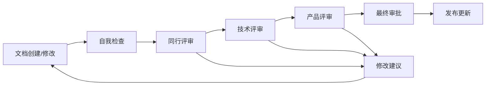

# StockLink 项目文档总览

## 项目信息

| 项目名称 | StockLink - 智能股票投资社交平台 |
|---------|----------------------------------|
| 项目状态 | 规划阶段 |
| 创建日期 | 2024年 |
| 产品经理 | PM-Core |
| 文档版本 | v1.0 |

---

## 📋 文档目录

### 1. 项目概述文档

#### 📄 [README.md](./README.md)
**文档类型**: 项目说明文档  
**主要内容**: 
- 项目概述和核心价值主张
- 目标用户群体分析
- 核心功能模块介绍
- 技术架构概览
- 商业模式和发展阶段
- 竞争优势分析

**适用人群**: 所有项目相关人员  
**更新频率**: 项目重大变更时更新

---

### 2. 产品规划文档

#### 📄 [PRD_StockLink_v1.0.md](./PRD_StockLink_v1.0.md)
**文档类型**: 产品需求文档 (Product Requirements Document)  
**主要内容**: 
- 产品愿景和定位
- 市场分析和竞品分析
- 详细用户画像
- 功能需求详细说明
- 非功能需求规范
- 用户体验设计要求
- 技术实现方案
- 商业模式设计
- 产品路线图
- 风险评估和成功指标

**适用人群**: 产品经理、开发团队、设计师、运营团队  
**更新频率**: 每个版本迭代前更新

#### 📄 [用户故事_StockLink_v1.0.md](./用户故事_StockLink_v1.0.md)
**文档类型**: 用户故事文档 (User Stories)  
**主要内容**: 
- 21个详细用户故事
- 按Epic分组的功能模块
- 验收标准和测试用例
- 优先级排序和工作量估算
- 用户故事地图
- 开发计划和时间安排

**适用人群**: 产品经理、开发团队、测试团队、Scrum Master  
**更新频率**: 每个Sprint规划时更新

#### 📄 [产品路线图_StockLink_v1.0.md](./产品路线图_StockLink_v1.0.md)
**文档类型**: 产品路线图 (Product Roadmap)  
**主要内容**: 
- 18个月完整发展规划
- 三个阶段详细计划 (MVP → 成长期 → 成熟期)
- 功能发布时间表
- 技术路线图
- 资源规划和预算
- 风险管理计划
- 成功指标和里程碑

**适用人群**: 高级管理层、产品团队、投资人  
**更新频率**: 每季度评估和调整

---

### 3. 技术设计文档

#### 📄 [技术架构设计_StockLink_v1.0.md](./技术架构设计_StockLink_v1.0.md)
**文档类型**: 技术架构文档 (Technical Architecture Document)  
**主要内容**: 
- 整体系统架构设计
- 技术栈选型和理由
- 核心模块详细设计
- 数据库设计和优化
- 性能优化策略
- 安全架构设计
- 监控和运维方案
- 部署和扩展性设计

**适用人群**: 技术团队、架构师、运维团队  
**更新频率**: 架构重大变更时更新

---

## 🎯 文档使用指南

### 新团队成员入门

**推荐阅读顺序**:
1. **README.md** - 了解项目基本情况
2. **PRD_StockLink_v1.0.md** - 深入理解产品需求
3. **用户故事_StockLink_v1.0.md** - 了解具体功能实现
4. **技术架构设计_StockLink_v1.0.md** - 掌握技术实现方案
5. **产品路线图_StockLink_v1.0.md** - 了解项目发展规划

### 不同角色关注重点

#### 🎨 产品经理
- **核心文档**: PRD、用户故事、产品路线图
- **关注点**: 用户需求、功能优先级、商业价值
- **工作流程**: 需求分析 → 用户故事编写 → 优先级排序 → 迭代规划

#### 💻 开发工程师
- **核心文档**: 用户故事、技术架构设计
- **关注点**: 功能实现、技术方案、开发计划
- **工作流程**: 技术方案设计 → 开发实现 → 测试验证 → 部署上线

#### 🎨 UI/UX设计师
- **核心文档**: PRD、用户故事
- **关注点**: 用户体验、界面设计、交互流程
- **工作流程**: 用户研究 → 原型设计 → 视觉设计 → 设计验证

#### 🚀 运营团队
- **核心文档**: README、PRD、产品路线图
- **关注点**: 用户获取、内容运营、数据分析
- **工作流程**: 运营策略 → 内容规划 → 用户运营 → 效果分析

#### 👔 管理层
- **核心文档**: README、产品路线图
- **关注点**: 商业价值、市场机会、资源配置
- **工作流程**: 战略规划 → 资源分配 → 进度监控 → 风险管控

---

## 📊 项目关键信息速览

### 产品定位
**智能股票投资社交平台** - 通过AI技术和社区力量，让每个人都能成为更好的投资者

### 目标用户
- **新手投资者** (25-35岁): 需要专业指导和教育内容
- **经验投资者** (30-50岁): 寻求高效分析工具和交流平台
- **专业投资者** (35-60岁): 需要高级工具和影响力展示平台

### 核心功能
1. **智能投资助手** - AI驱动的个性化投资建议
2. **市场数据中心** - 实时行情和专业分析工具
3. **投资社区** - 投资者交流和学习平台
4. **个人投资管理** - 投资组合和收益分析

### 技术架构
- **前端**: React 18 + TypeScript
- **后端**: Node.js + Python 微服务架构
- **数据库**: PostgreSQL + MongoDB + Redis
- **AI引擎**: TensorFlow + PyTorch
- **部署**: Docker + Kubernetes

### 发展计划
- **MVP阶段** (3个月): 验证核心价值，获得1000+用户
- **成长期** (9个月): 完善功能，达到10万+用户，实现商业化
- **成熟期** (6个月): 行业领先地位，100万+用户，年收入1亿+

### 商业模式
- **订阅服务**: 基础版免费，专业版99元/月，旗舰版299元/月
- **增值服务**: 专家咨询、定制报告、培训课程
- **合作分成**: 券商佣金、基金销售、精准广告

---

## 🔄 文档维护流程

### 文档更新原则
1. **及时性**: 重大变更后24小时内更新相关文档
2. **准确性**: 确保文档内容与实际实现保持一致
3. **完整性**: 变更时同步更新所有相关文档
4. **可追溯**: 记录详细的变更历史和原因

### 文档评审流程

### 版本管理
- **主版本号**: 重大架构变更或功能重构
- **次版本号**: 新功能添加或重要功能修改
- **修订号**: Bug修复或文档优化

**示例**: v1.2.3
- v1: 主版本 (重大变更)
- v1.2: 次版本 (功能更新)
- v1.2.3: 修订版 (问题修复)

---

## 📞 联系方式

### 文档负责人
- **产品文档**: PM-Core (产品经理)
- **技术文档**: 技术架构师
- **项目管理**: 项目经理

### 反馈渠道
- **文档问题**: 提交Issue到项目管理系统
- **改进建议**: 发送邮件到产品团队
- **紧急问题**: 联系项目经理

---

## 📈 文档质量指标

### 质量标准
- **完整性**: 覆盖所有必要的产品和技术信息
- **准确性**: 与实际实现保持100%一致
- **可读性**: 结构清晰，语言简洁明了
- **实用性**: 能够指导实际的开发和运营工作

### 评估指标
- **文档使用率**: 团队成员查阅文档的频率
- **问题反馈率**: 因文档问题导致的工作阻塞次数
- **更新及时性**: 变更后文档更新的平均时间
- **团队满意度**: 团队对文档质量的评价

---

## 🎉 总结

本项目文档体系为StockLink平台的成功开发和运营提供了完整的指导框架。通过系统化的文档管理，我们能够：

✅ **确保团队对齐**: 所有成员对产品目标和技术方案有统一认知  
✅ **提高开发效率**: 清晰的需求和技术文档减少沟通成本  
✅ **保证产品质量**: 详细的验收标准和测试用例确保功能完整性  
✅ **支持决策制定**: 完整的市场分析和风险评估支持管理决策  
✅ **促进知识传承**: 结构化的文档便于新成员快速上手  

### 下一步行动
1. **团队培训**: 组织文档使用培训，确保所有成员熟悉文档体系
2. **工具配置**: 建立文档管理工具和协作平台
3. **流程建立**: 制定文档维护和更新的标准流程
4. **定期评估**: 建立文档质量评估和改进机制

通过严格执行文档管理流程，我们将为StockLink项目的成功奠定坚实的基础。

---

**最后更新**: 2024年  
**文档状态**: ✅ 已完成  
**下次评审**: 项目启动后1个月